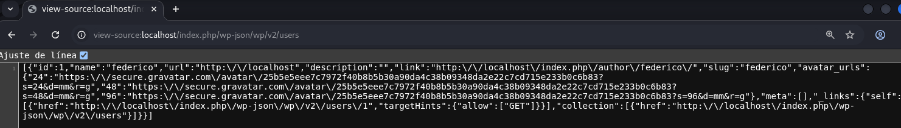
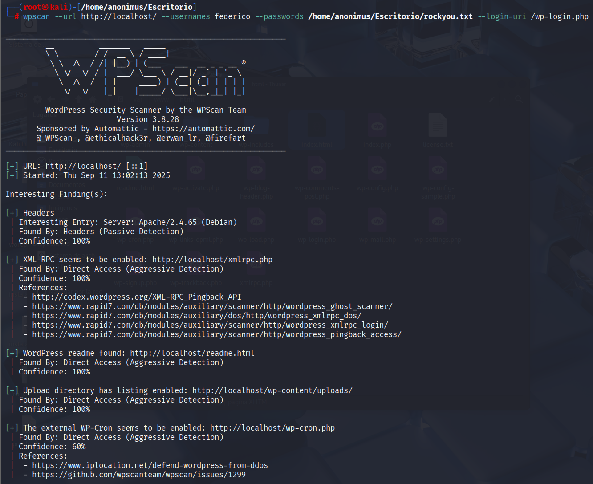
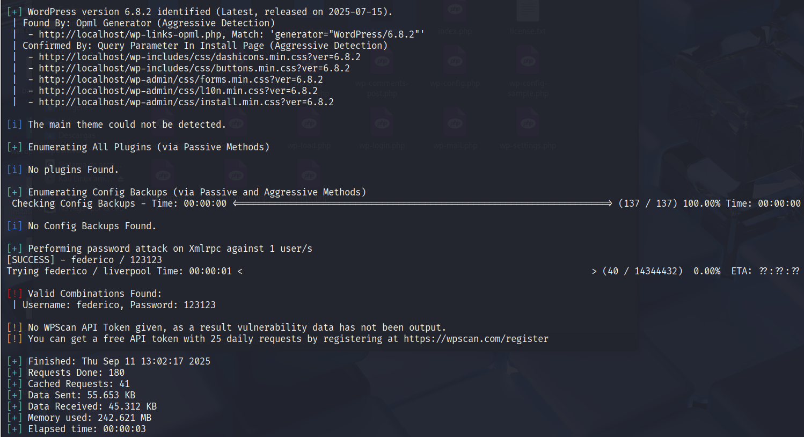
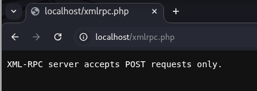

# Análisis de Seguridad WordPress - Ataque de Fuerza Bruta

## Introducción

En este repositorio se documenta un ejercicio de análisis de seguridad realizado contra una instalación de WordPress en un entorno controlado. El objetivo principal es demostrar técnicas de penetración mediante ataques de fuerza bruta utilizando herramientas especializadas, específicamente WPScan, para identificar vulnerabilidades comunes en implementaciones de WordPress.

El entorno de pruebas consiste en:
- Máquina objetivo: WordPress 6.8.2 instalado en localhost
- Sistema atacante: Distribución Kali Linux
- Herramienta principal: WPScan
- Wordlist: rockyou.txt

## Índice

1. [Reconocimiento y Enumeración](#reconocimiento-y-enumeración)
2. [Ataque de Fuerza Bruta con WPScan](#ataque-de-fuerza-bruta-con-wpscan)
3. [Vulnerabilidades Identificadas](#vulnerabilidades-identificadas)
4. [Servicios Expuestos](#servicios-expuestos)
5. [Recomendaciones de Seguridad](#recomendaciones-de-seguridad)
6. [Conclusión](#conclusión)

## Reconocimiento y Enumeración

Antes de realizar el ataque de fuerza bruta, se llevó a cabo una fase de reconocimiento para identificar información crítica del sistema objetivo:

### Descubrimiento de Usuarios
Mediante la API REST de WordPress (`/wp-json/wp/v2/users`), se identificó un usuario válido:
- **Usuario**: federico
- **ID**: 1
- **Slug**: federico



### Análisis de Servicios
El escaneo inicial con WPScan reveló varios servicios expuestos:
- Servidor: Apache/2.4.65 (Debian)
- XML-RPC habilitado (aceptando solo solicitudes POST)
- Directorio de uploads con listado de archivos habilitado
- WP-Cron externo habilitado
- Archivo readme.html expuesto

## Ataque de Fuerza Bruta con WPScan

### Configuración del Ataque
Se ejecutó WPScan con los siguientes parámetros:
```bash
wpscan --url http://localhost/ --usernames federico --passwords /home/anonimus/Excricorio/rockyou.txt --login-url /wp-login.php
```

### Resultados del Ataque
El ataque tuvo éxito en un tiempo remarkably corto:
- **Credenciales comprometidas**: Usuario "federico" con contraseña "123123"
- **Tiempo de compromiso**: Aproximadamente 3 segundos
- **Intentos realizados**: Solo 40 de 14,344,432 posibles contraseñas (0.0003%)




## Vulnerabilidades Identificadas

1. **Contraseña Débil** (Crítica)
   - Contraseña "123123" extremadamente vulnerable a ataques de diccionario

2. **API de Usuarios Expuesta** (Alta)
   - Endpoint `/wp-json/wp/v2/users` expuesto sin restricciones

3. **XML-RPC Habilitado** (Media)
   - Servicio XML-RPC aceptando solicitudes POST
   

4. **Listado de Directorios Habilitado** (Media)
   - Directorio `/wp-content/uploads/` con listado de archivos habilitado

## Servicios Expuestos

El análisis identificó múltiples servicios potencialmente vulnerables:

1. **XML-RPC**
   - Habilitado y aceptando solicitudes POST
   - Potencial vector para ataques de amplificación

2. **WP-Cron Externo**
   - Habilitado, potencialmente explotable para ataques DoS

3. **Archivos de Configuración Expuestos**
   - readme.html expuesto revelando versión de WordPress
   - Directorios con listado de archivos habilitado

## Recomendaciones de Seguridad

1. **Políticas de Contraseñas**
   - Implementar contraseñas complejas (mínimo 12 caracteres con combinación de mayúsculas, minúsculas, números y símbolos)
   - Forzar cambio periódico de contraseñas

2. **Protección contra Fuerza Bruta**
   - Implementar límite de intentos de login
   - Integrar CAPTCHA en formularios de autenticación
   - Considerar autenticación de dos factores

3. **Configuración de Servicios**
   - Deshabilitar XML-RPC si no es necesario
   - Restringir acceso a la API REST de usuarios
   - Deshabilitar listado de directorios

4. **Hardening de WordPress**
   - Limitar el acceso a wp-login.php por dirección IP
   - Cambiar la URL por defecto del panel de administración
   - Ocultar la versión de WordPress

## Conclusión

Este ejercicio demostró la efectividad de los ataques de fuerza bruta contra instalaciones de WordPress mal configuradas. La combinación de contraseñas débiles y servicios innecesariamente expuestos crea un entorno vulnerable que puede ser comprometido en cuestión de segundos.

La implementación de medidas básicas de hardening y políticas de contraseñas robustas podría haber prevenido este compromiso, destacando la importancia de mantener configuraciones seguras incluso en entornos de desarrollo.

---
**Nota Legal**: Este análisis se realizó en un entorno controlado con fines educativos. El testing de penetración debe realizarse únicamente en sistemas con autorización explícita del propietario.
